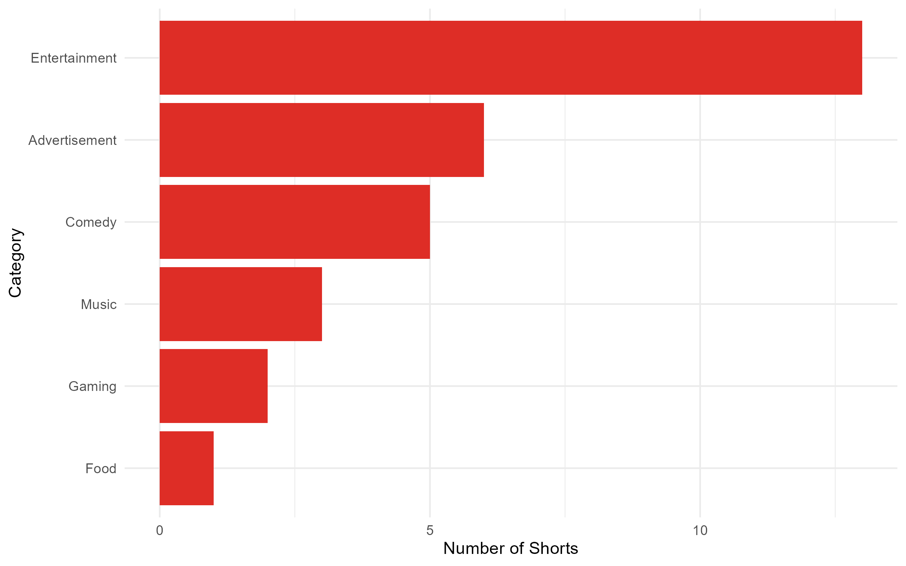
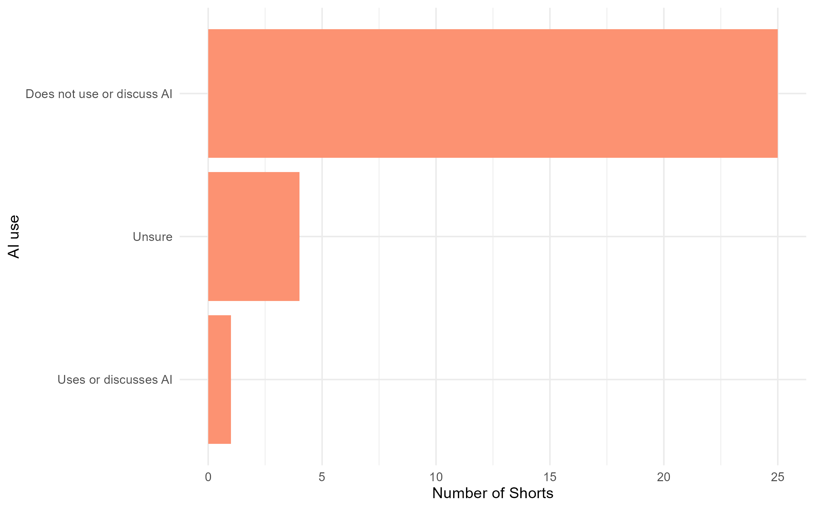
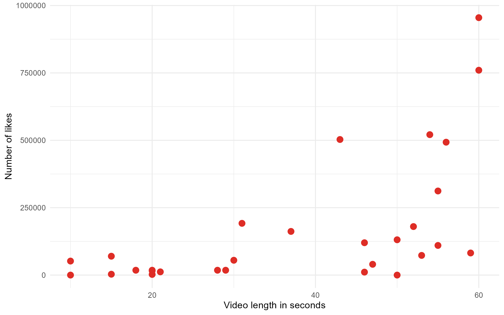
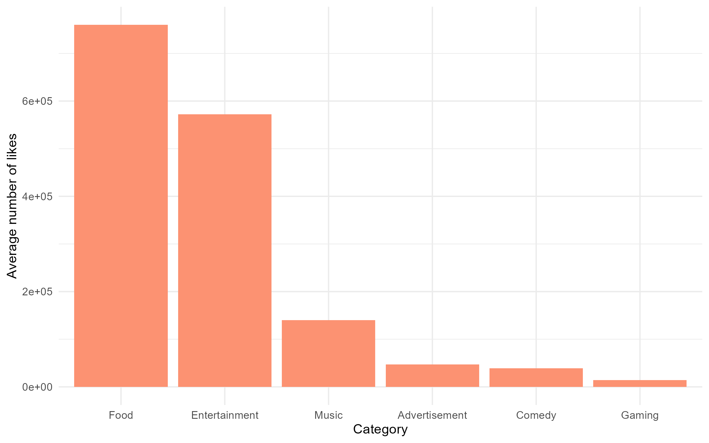
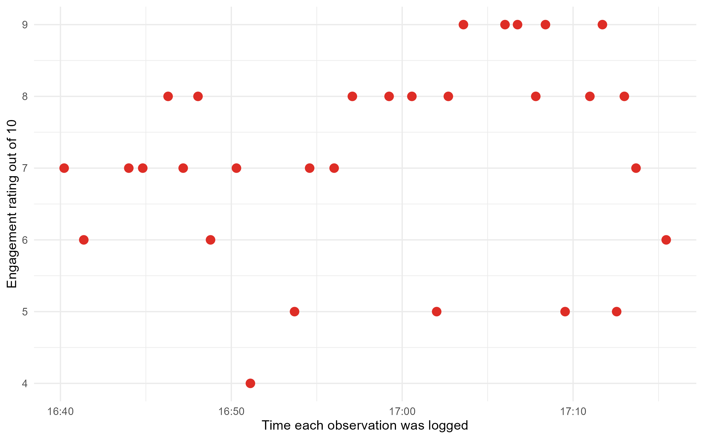

<script src="https://code.jquery.com/jquery-3.7.1.min.js" integrity="sha256-/JqT3SQfawRcv/BIHPThkBvs0OEvtFFmqPF/lYI/Cxo=" crossorigin="anonymous"></script>

```{r setup, include=FALSE}
knitr::opts_chunk$set(echo=FALSE, message=FALSE, warning=FALSE, error=FALSE)
```

```{js}
$(function() {
  $(".level2").css('visibility', 'hidden');
  $(".level2").first().css('visibility', 'visible');
  $(".container-fluid").height($(".container-fluid").height() + 300);
  $(window).on('scroll', function() {
    $('h2').each(function() {
      var h2Top = $(this).offset().top - $(window).scrollTop();
      var windowHeight = $(window).height();
      if (h2Top >= 0 && h2Top <= windowHeight / 2) {
        $(this).parent('div').css('visibility', 'visible');
      } else if (h2Top > windowHeight / 2) {
        $(this).parent('div').css('visibility', 'hidden');
      }
    });
  });
})
```

```{css, echo=FALSE}
body {
  background-color: #fee0d2;
  color: #202020;
  font-family: Arial, sans-serif;
}

h1 {
  color: #de2d26;
  text-align: center;
  font-weight: 900;
  text-shadow: 0 0 10px #fc9272;
}

h2 {
  color: #de2d26;
  font-weight: 900;
  text-align: center;
  border-bottom: 4px solid #fc9272;
  padding-bottom: 8px;
  text-shadow: 0 0 8px #fc9272;
}

p {
  font-size: 18px;
  line-height: 1.6;
}

img {
  max-width: 100%;
  border: 4px solid #fc9272;
  border-radius: 14px;
  box-shadow: 0 0 22px #fc9272;
  margin-top: 12px;
  margin-bottom: 12px;
}

.figcaption {
  display: none;
}
```

## Introduction

This visual data story explores patterns in YouTube Shorts using observations collected through a Google Form. Each row represents one Short and records its category, length, likes, AI use, and engagement rating.

The aim is to explore how different features of Shorts may connect to engagement. I used a red colour palette to match the style of short-form video platforms.

## What categories appeared most often?



Entertainment-based videos appeared most often in my observations, followed by advertisement and comedy.

This suggests that my Shorts feed was mostly made up of fast, attention-grabbing content. However, being the most common category does not necessarily mean it gets the most engagement. The category likes graph later shows that food videos received more likes on average, even though food was not one of the most common categories in my sample.

Advertisement being common is also interesting because short-form ads often copy the style of entertainment videos to keep viewers watching.

## How common was AI in the Shorts?



This graph shows that AI was not a major feature in most of the Shorts I logged.

Even though AI is popular online, my sample was mostly made up of other types of content, such as entertainment, advertisements, comedy, music, and gaming.

## Did video length relate to likes?



This plot compares the length of each YouTube Short with the number of likes it had. I removed one extreme high-like video because it made the rest of the points much harder to see clearly.

After removing that extreme value, the graph is easier to compare. Some longer Shorts received more likes, but the pattern is still not strong enough to say that longer videos always perform better. This suggests that video length alone does not clearly explain likes.

## Did some categories receive more likes?



This visualisation compares the average number of likes for each category. It adds to the previous plot because it shows that likes may not only be affected by video length.

Food videos received the highest average number of likes in my sample, even though food was not one of the most common categories overall. This shows that the categories appearing most often in my feed were not necessarily the categories with the highest engagement.

This suggests that the type of content could affect likes in different ways. Entertainment appeared most often, but food videos seemed to perform better on average in terms of likes.

## When were my observations logged?



This plot uses the Google Form timestamp, converted with the lubridate package.

The engagement ratings stayed fairly similar across my logging session. This suggests I did not become much less engaged or bored while collecting the data, which gives more context to the engagement ratings.

## Conclusion

Overall, entertainment and advertisement appeared often in my sample, AI was not commonly used, and video length did not fully explain likes. The category likes plot shows that the type of content may also affect engagement. The timestamp plot shows that my engagement ratings stayed fairly consistent while I collected the data.
